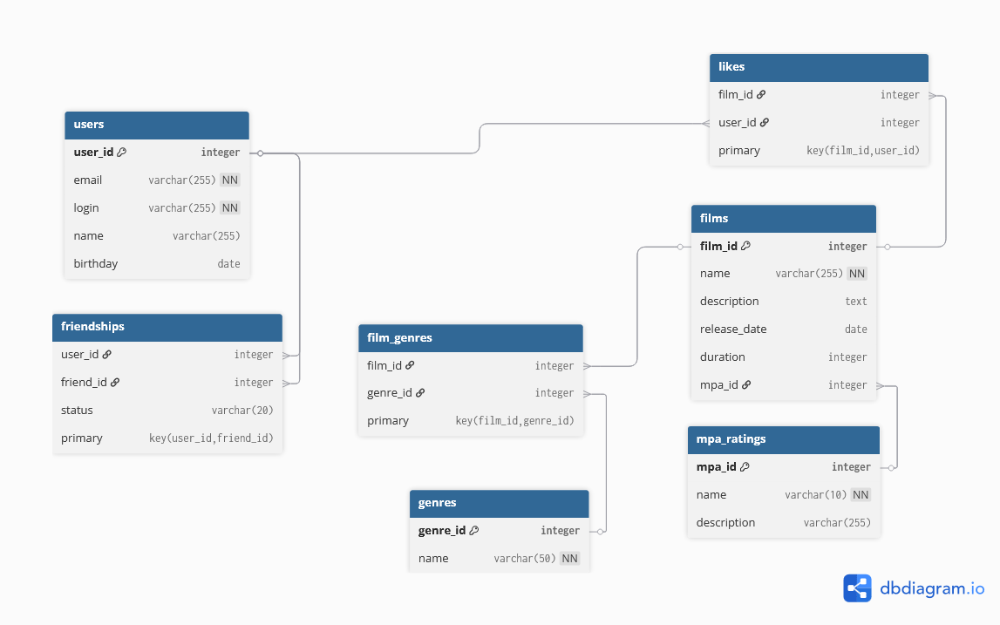

# Filmorate Project

## Схема базы данных



## Описание схемы

Спроектированная база данных соответствует **третьей нормальной форме (3NF)** и поддерживает все бизнес-процессы приложения Filmorate.

### Основные таблицы:

- **users** - хранение данных пользователей
- **films** - хранение данных фильмов  
- **mpa_ratings** - справочник рейтингов MPA (G, PG, PG-13, R, NC-17)
- **genres** - справочник жанров фильмов

### Таблицы связей:

- **friendships** - дружеские связи между пользователями с статусами (pending/confirmed)
- **film_genres** - связь фильмов с жанрами (многие-ко-многим)
- **likes** - лайки пользователей фильмам

## Инициализация данных

```sql
-- Рейтинги MPA
INSERT INTO mpa_ratings VALUES
(1, 'G', 'Нет возрастных ограничений'),
(2, 'PG', 'Детям рекомендуется смотреть с родителями'),
(3, 'PG-13', 'Детям до 13 лет просмотр не желателен'),
(4, 'R', 'Лицам до 17 лет просмотр с взрослым'),
(5, 'NC-17', 'Лицам до 18 лет просмотр запрещён');

-- Жанры
INSERT INTO genres VALUES
(1, 'Комедия'),
(2, 'Драма'),
(3, 'Мультфильм'),
(4, 'Триллер'),
(5, 'Документальный'),
(6, 'Боевик');
```

## Примеры SQL запросов

### Для пользователей:

```sql
-- Создание пользователя
INSERT INTO users (email, login, name, birthday) 
VALUES ('user@example.com', 'userlogin', 'User Name', '1990-01-01');

-- Добавление в друзья (неподтверждённая)
INSERT INTO friendships (user_id, friend_id, status) 
VALUES (1, 2, 'pending');

-- Подтверждение дружбы
UPDATE friendships SET status = 'confirmed' 
WHERE user_id = 2 AND friend_id = 1;

-- Получение друзей пользователя
SELECT u.* FROM users u
JOIN friendships f ON u.user_id = f.friend_id
WHERE f.user_id = 1 AND f.status = 'confirmed';

-- Общие друзья двух пользователей
SELECT u.* FROM users u
JOIN friendships f1 ON u.user_id = f1.friend_id AND f1.user_id = 1
JOIN friendships f2 ON u.user_id = f2.friend_id AND f2.user_id = 2
WHERE f1.status = 'confirmed' AND f2.status = 'confirmed';
```

### Для фильмов:

```sql
-- Создание фильма
INSERT INTO films (name, description, release_date, duration, mpa_id)
VALUES ('Film Name', 'Description', '2020-01-01', 120, 3);

-- Добавление жанров фильму
INSERT INTO film_genres (film_id, genre_id) VALUES (1, 1), (1, 2);

-- Добавление лайка
INSERT INTO likes (film_id, user_id) VALUES (1, 1);

-- Получение популярных фильмов (топ-10)
SELECT f.*, COUNT(l.user_id) as likes_count
FROM films f
LEFT JOIN likes l ON f.film_id = l.film_id
GROUP BY f.film_id
ORDER BY likes_count DESC
LIMIT 10;

-- Получение фильма с жанрами и рейтингом MPA
SELECT f.*, m.name as mpa_name, 
       GROUP_CONCAT(g.name) as genres
FROM films f
JOIN mpa_ratings m ON f.mpa_id = m.mpa_id
LEFT JOIN film_genres fg ON f.film_id = fg.film_id
LEFT JOIN genres g ON fg.genre_id = g.genre_id
WHERE f.film_id = 1
GROUP BY f.film_id;
```

